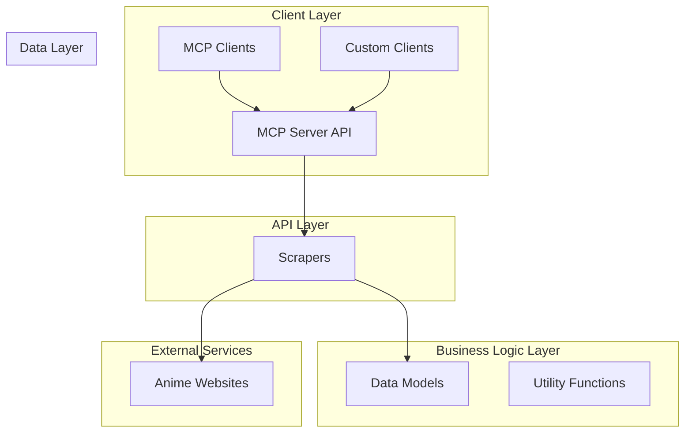
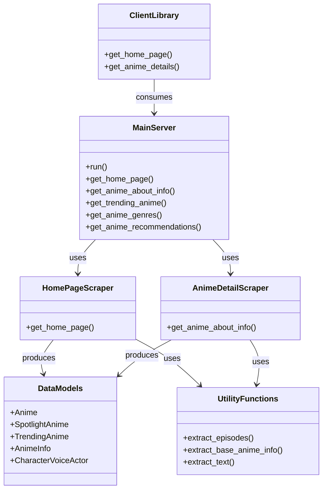
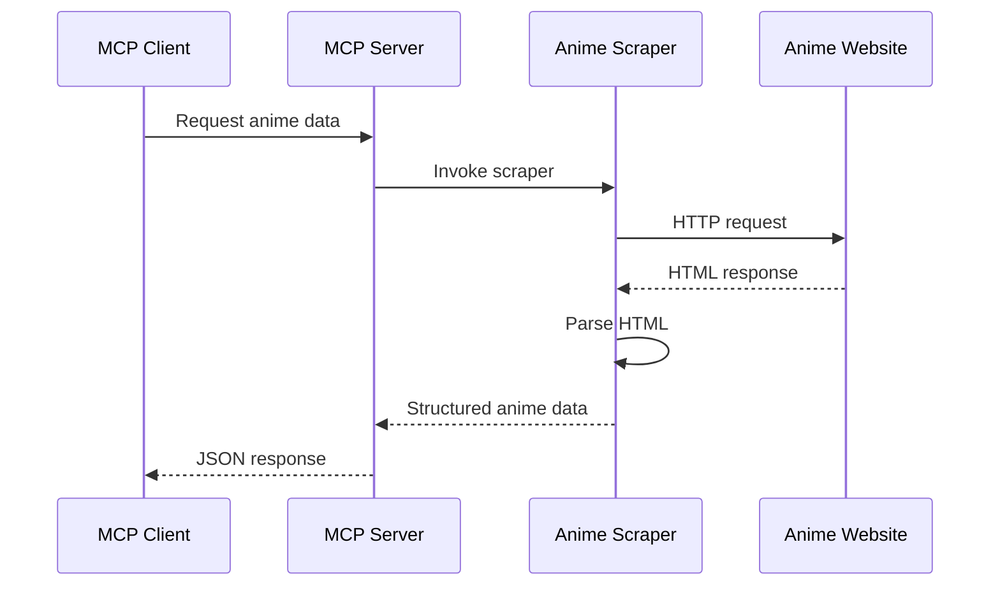
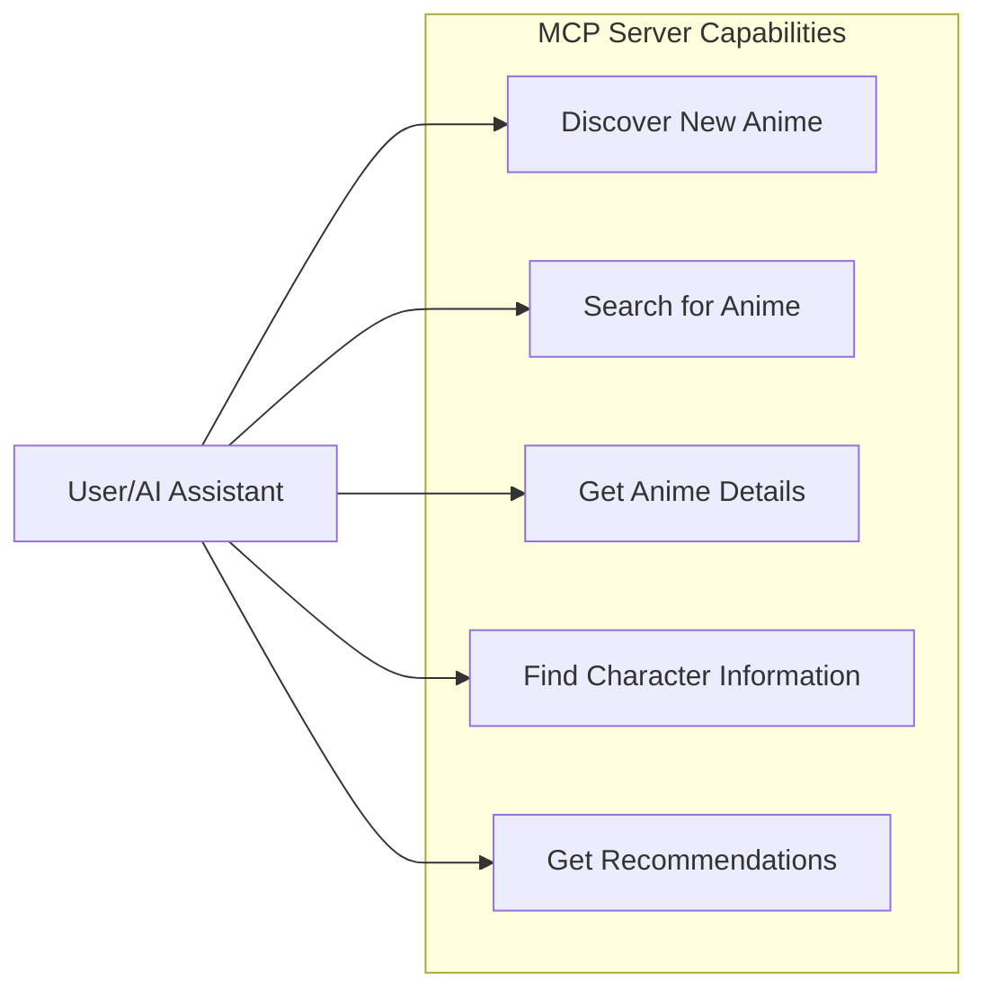

# Hianime-MCP: A Comprehensive Analysis

This document provides an in-depth exploration of the **hianime-mcp** project from multiple perspectives: software architecture, development practices, and product management.

## Table of Contents

1. [Project Overview](#project-overview)
2. [Architecture Analysis](#architecture-analysis)
   - [System Architecture](#system-architecture)
   - [Component Diagram](#component-diagram)
   - [Data Flow](#data-flow)
3. [Technical Implementation](#technical-implementation)
   - [Core Technologies](#core-technologies)
   - [Code Organization](#code-organization)
   - [Key Modules](#key-modules)
4. [Product Perspective](#product-perspective)
   - [Target Users](#target-users)
   - [Use Cases](#use-cases)
   - [Potential Extensions](#potential-extensions)
5. [Development Insights](#development-insights)
   - [Testing Strategy](#testing-strategy)
   - [Code Quality](#code-quality)
   - [Potential Improvements](#potential-improvements)
6. [Conclusion](#conclusion)

## Project Overview

Hianime-MCP is a microservice that provides anime information through the Model Context Protocol (MCP) interface. The project serves as a bridge between anime data sources and AI assistants, enabling natural language interactions about anime content.

The service scrapes data from anime websites (primarily hianimez.to) and exposes it through a standardized MCP API, which can be consumed by AI-powered applications, chatbots, and other services that implement the MCP client standard.

Key capabilities include:
- Homepage information retrieval (spotlight and trending anime)
- Detailed anime information lookup
- Genre listings
- Character and voice actor information
- Promotional video data
- Related and recommended anime discovery

## Architecture Analysis

### System Architecture

The project follows a layered architecture pattern with clear separation of concerns:



### Component Diagram

The following diagram illustrates the main components of the system and their interactions:



### Data Flow

The flow of data through the system follows this pattern:



## Technical Implementation

### Core Technologies

The project is built using:

1. **Python 3.12** - Core programming language
2. **FastMCP** - Implementation of the Model Context Protocol server
3. **BeautifulSoup4** - HTML parsing and scraping
4. **Cloudscraper** - Handling Cloudflare protection
5. **Pydantic** - Data validation and settings management
6. **Requests/Aiohttp** - HTTP request handling

### Code Organization

The codebase follows a well-structured organization:

```
src/
├── management/     # Logging and debugging tools
├── models/         # Data models for anime objects
├── scrapers/       # Web scraping functionality 
└── utils/          # Utility functions and configuration
```

Key structural elements:

1. **Models** - Dataclasses representing anime, characters, episodes, etc.
2. **Scrapers** - Functions to extract data from web pages
3. **Utils** - Helper functions for extraction, configuration, and constants
4. **Management** - Logging and error handling

### Key Modules

1. **main.py** - Entry point with MCP server definition and tool endpoints
2. **src/models/** - Data structures for anime information
3. **src/scrapers/** - Web scraping implementation for different anime data
4. **src/utils/** - Utility functions for HTML parsing and data extraction
5. **client.py** - Client library for consuming the MCP service

## Product Perspective

### Target Users

The project serves several distinct user types:

1. **AI System Developers** - Integrating anime data into AI assistants
2. **Application Developers** - Building anime-related applications
3. **End Users** - Indirectly benefiting through AI assistants that access anime data

### Use Cases

Key use cases for the system include:



1. **Anime Discovery** - Finding trending or spotlight anime
2. **Information Lookup** - Getting detailed information about specific anime
3. **Genre Exploration** - Browsing anime by genre
4. **Character Information** - Finding details about characters and voice actors
5. **Recommendation** - Discovering related anime based on interests

### Potential Extensions

The product could be extended in several ways:

1. **User Authentication** - Adding user accounts for personalized recommendations
2. **Watch History** - Tracking watched episodes
3. **Notifications** - Alerts for new episodes
4. **Advanced Search** - More robust search capabilities
5. **Multiple Data Sources** - Integrating additional anime data providers
6. **Streaming Integration** - Direct links to legal streaming platforms

## Development Insights

### Testing Strategy

The project includes:

1. **Unit Tests** - Testing individual scrapers and extractors
2. **Integration Tests** - End-to-end testing of the MCP server
3. **Sample Data** - HTML samples for consistent testing

Areas for testing improvement:
- More comprehensive test coverage
- Mock responses for reliable testing
- Performance testing for scalability

### Code Quality

Strengths:
- Clear separation of concerns
- Well-defined data models
- Robust error handling
- Logging throughout the system
- Consistent coding style

Potential improvements:
- More comprehensive documentation
- Increased test coverage
- Type hints throughout the codebase
- Performance optimizations for large responses

### Potential Improvements

Technical debt and areas for enhancement:

1. **Caching** - Implement request caching to reduce load on source websites
2. **Rate Limiting** - More sophisticated rate limiting to avoid being blocked
3. **Async Operations** - Expand asynchronous processing for better performance
4. **Error Recovery** - Enhanced retry mechanisms and fallbacks
5. **Alternative Sources** - Backup data sources if primary sites are unavailable
6. **Schema Evolution** - Forward/backward compatibility for API changes

## Conclusion

The hianime-mcp project provides a well-structured implementation of an MCP server for anime data. It successfully bridges the gap between raw anime website data and AI assistants through the MCP protocol, enabling natural language interactions about anime content.

From an architectural perspective, the system demonstrates good separation of concerns and modular design. The technical implementation uses appropriate libraries for web scraping and data processing, with clear data models and error handling.

From a product perspective, the service addresses a niche but valuable use case, enabling AI assistants to access and reason about anime content. There is potential for expansion into more comprehensive anime data services with additional features and integrations.

The development quality shows attention to error handling and logging, with areas for improvement in testing coverage and documentation. Overall, the project provides a solid foundation for anime data retrieval through the MCP protocol.
