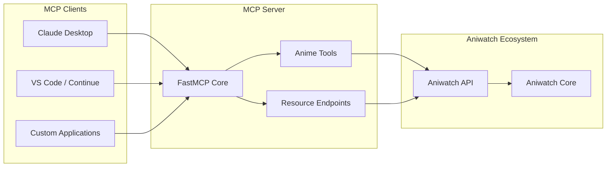

# Integrating Aniwatch with Model Context Protocol (MCP)

This guide explains how to integrate the Aniwatch ecosystem with the Model Context Protocol (MCP) to create an AI assistant that can interact with anime data.

## Table of Contents
1. [Introduction to MCP Integration](#introduction-to-mcp-integration)
2. [Architecture Overview](#architecture-overview)
3. [Implementation Guide](#implementation-guide)
   - [Setting up the MCP Server](#setting-up-the-mcp-server)
   - [Creating Anime Data Tools](#creating-anime-data-tools)
   - [Resource Endpoints for Anime Data](#resource-endpoints-for-anime-data)
   - [Advanced Capabilities](#advanced-capabilities)
4. [Example Implementations](#example-implementations)
5. [Testing and Deployment](#testing-and-deployment)
6. [Performance Considerations](#performance-considerations)

## Introduction to MCP Integration

The Model Context Protocol (MCP) allows AI assistants to access external tools and resources. By integrating the Aniwatch system with MCP, we can create an AI assistant that can:

- Search for anime information
- Retrieve episode details
- Get streaming links
- Provide user recommendations
- Answer questions about anime content

This integration enables conversational access to the anime data provided by Aniwatch, creating more interactive and helpful user experiences.

## Architecture Overview

The integration architecture consists of three main components:

1. **Aniwatch Core and API** - The existing anime data retrieval system
2. **MCP Server** - A Python-based server using FastMCP that exposes Aniwatch functionality
3. **MCP Clients** - Applications that can connect to the MCP server to access the anime data



## Implementation Guide

### Setting up the MCP Server

First, we need to set up a FastMCP server that will expose Aniwatch functionality:

```python
# anime_mcp_server.py
import requests
from mcp.server.fastmcp import FastMCP

# Create an MCP server for anime data
mcp = FastMCP("Anime Assistant")

# Base URL for the Aniwatch API
API_BASE_URL = "http://localhost:3000/api/v2/hianime"  # Update with your actual API URL
```

### Creating Anime Data Tools

Next, we'll implement MCP tools that interact with the Aniwatch API:

```python
# Tool for searching anime
@mcp.tool()
def search_anime(query: str, page: int = 1) -> dict:
    """
    Search for anime by name or keywords
    
    Args:
        query: The search term
        page: Page number for results (default: 1)
    
    Returns:
        Dictionary containing search results
    """
    response = requests.get(f"{API_BASE_URL}/search", params={
        "q": query,
        "page": page
    })
    return response.json()["data"]

# Tool for getting anime details
@mcp.tool()
def get_anime_info(anime_id: str) -> dict:
    """
    Get detailed information about a specific anime
    
    Args:
        anime_id: The unique ID of the anime
    
    Returns:
        Dictionary containing anime details
    """
    response = requests.get(f"{API_BASE_URL}/info/{anime_id}")
    return response.json()["data"]

# Tool for fetching episode list
@mcp.tool()
def get_episodes(anime_id: str, page: int = 1) -> dict:
    """
    Get episodes for a specific anime
    
    Args:
        anime_id: The unique ID of the anime
        page: Page number for results (default: 1)
    
    Returns:
        Dictionary containing episode information
    """
    response = requests.get(f"{API_BASE_URL}/episodes/{anime_id}", params={"page": page})
    return response.json()["data"]

# Tool for getting streaming options
@mcp.tool()
def get_streaming_sources(episode_id: str, server: str = "vidstreaming") -> dict:
    """
    Get streaming sources for a specific episode
    
    Args:
        episode_id: The unique episode ID
        server: Server to get sources from (default: vidstreaming)
    
    Returns:
        Dictionary containing streaming sources
    """
    response = requests.get(f"{API_BASE_URL}/episode-srcs", params={
        "id": episode_id,
        "server": server
    })
    return response.json()["data"]
```

### Resource Endpoints for Anime Data

We can also expose anime information as MCP resources, which allows the AI to directly reference anime content:

```python
# Resource for anime info
@mcp.resource("anime://{anime_id}")
def get_anime_resource(anime_id: str) -> dict:
    """
    Resource endpoint for anime information
    
    Args:
        anime_id: The unique ID of the anime
    
    Returns:
        Dictionary containing anime details
    """
    response = requests.get(f"{API_BASE_URL}/info/{anime_id}")
    return response.json()["data"]

# Resource for episode information
@mcp.resource("episode://{anime_id}/{episode_number}")
def get_episode_resource(anime_id: str, episode_number: str) -> dict:
    """
    Resource endpoint for episode information
    
    Args:
        anime_id: The unique ID of the anime
        episode_number: The episode number
    
    Returns:
        Dictionary containing episode details
    """
    response = requests.get(f"{API_BASE_URL}/episodes/{anime_id}")
    data = response.json()["data"]
    
    # Find the specific episode
    episode = next((ep for ep in data["episodes"] if ep["number"] == int(episode_number)), None)
    return episode if episode else {"error": "Episode not found"}
```

### Advanced Capabilities

For more advanced functionality, we can add tools that combine multiple API calls and add contextual processing:

```python
# Tool for personalized recommendations
@mcp.tool()
def get_anime_recommendations(genres: list = None, type: str = None, limit: int = 5) -> list:
    """
    Get anime recommendations based on genres and type
    
    Args:
        genres: List of genre IDs to filter by
        type: Type of anime (TV, Movie, OVA, etc.)
        limit: Maximum number of recommendations
    
    Returns:
        List of recommended anime
    """
    # Get top anime from home page
    response = requests.get(f"{API_BASE_URL}/home")
    data = response.json()["data"]
    
    # Extract relevant anime based on criteria
    all_anime = []
    all_anime.extend(data.get("popular", []))
    all_anime.extend(data.get("trending", []))
    
    # Filter by criteria if provided
    filtered_anime = all_anime
    
    if genres:
        filtered_anime = [anime for anime in filtered_anime 
                         if any(g["id"] in genres for g in anime.get("genres", []))]
    
    if type:
        filtered_anime = [anime for anime in filtered_anime 
                         if anime.get("type") == type]
    
    # Return limited results
    return filtered_anime[:limit]
```

## Example Implementations

Here's a complete example of an MCP server that integrates with Aniwatch:

```python
# anime_mcp_server.py
import requests
import logging
from mcp.server.fastmcp import FastMCP

# Configure logging
logging.basicConfig(level=logging.INFO, 
                   format='%(asctime)s - %(name)s - %(levelname)s - %(message)s')
logger = logging.getLogger("AnimeMCP")

# Create MCP server
mcp = FastMCP("Anime Assistant")

# Base URL for the Aniwatch API
API_BASE_URL = "http://localhost:3000/api/v2/hianime"  # Update with your API URL

# Error handling wrapper
def api_request(endpoint, params=None):
    try:
        url = f"{API_BASE_URL}/{endpoint}"
        logger.info(f"Requesting: {url} with params: {params}")
        response = requests.get(url, params=params)
        
        if response.status_code != 200:
            logger.error(f"API error: {response.status_code} - {response.text}")
            return {"error": f"API returned status {response.status_code}"}
        
        return response.json().get("data", {})
    except Exception as e:
        logger.error(f"Exception in API request: {str(e)}")
        return {"error": str(e)}

# Define tools
@mcp.tool()
def search_anime(query: str, page: int = 1) -> dict:
    """Search for anime by name or keywords"""
    return api_request("search", {"q": query, "page": page})

@mcp.tool()
def get_anime_info(anime_id: str) -> dict:
    """Get detailed information about a specific anime"""
    return api_request(f"info/{anime_id}")

@mcp.tool()
def get_episodes(anime_id: str, page: int = 1) -> dict:
    """Get episodes for a specific anime"""
    return api_request(f"episodes/{anime_id}", {"page": page})

@mcp.tool()
def get_streaming_sources(episode_id: str, server: str = "vidstreaming") -> dict:
    """Get streaming sources for a specific episode"""
    return api_request("episode-srcs", {"id": episode_id, "server": server})

@mcp.tool()
def get_top_anime() -> dict:
    """Get the current top anime"""
    return api_request("home")

# Define resources
@mcp.resource("anime://{anime_id}")
def get_anime_resource(anime_id: str) -> dict:
    """Resource endpoint for anime information"""
    return api_request(f"info/{anime_id}")

@mcp.resource("top-anime://trending")
def get_trending_anime() -> list:
    """Resource endpoint for trending anime"""
    data = api_request("home")
    return data.get("trending", [])

@mcp.resource("top-anime://popular")
def get_popular_anime() -> list:
    """Resource endpoint for popular anime"""
    data = api_request("home")
    return data.get("popular", [])

# Run the MCP server
if __name__ == "__main__":
    mcp.run(host="0.0.0.0", port=8000)
```

## Testing and Deployment

### Local Testing

To test the MCP server locally:

1. Start the Aniwatch API server:
   ```bash
   cd aniwatch-api
   npm run dev
   ```

2. Start the MCP server:
   ```bash
   python anime_mcp_server.py
   ```

3. Connect with an MCP client like Claude Desktop or Continue for VS Code.

### Integration Testing

Create test scripts to verify each tool and resource:

```python
# test_mcp_integration.py
import requests

# Test MCP tools endpoint
def test_search_tool():
    response = requests.post(
        "http://localhost:8000/tools/search_anime",
        json={"input": {"query": "Steins Gate"}}
    )
    assert response.status_code == 200
    data = response.json()
    assert "results" in data

# Run tests
if __name__ == "__main__":
    test_search_tool()
    print("All tests passed!")
```

### Deployment

For production deployment, you can use Docker to containerize both the Aniwatch API and the MCP server:

```dockerfile
# Dockerfile for Anime MCP Server
FROM python:3.11-slim

WORKDIR /app

COPY requirements.txt .
RUN pip install --no-cache-dir -r requirements.txt

COPY anime_mcp_server.py .

EXPOSE 8000

CMD ["python", "anime_mcp_server.py"]
```

Docker Compose for complete setup:

```yaml
version: '3.8'

services:
  aniwatch-api:
    build: ./aniwatch-api
    ports:
      - "3000:3000"
    environment:
      - NODE_ENV=production
    healthcheck:
      test: ["CMD", "curl", "-f", "http://localhost:3000/health"]
      interval: 30s
      timeout: 10s
      retries: 3

  anime-mcp:
    build: ./anime-mcp
    ports:
      - "8000:8000"
    environment:
      - API_BASE_URL=http://aniwatch-api:3000/api/v2/hianime
    depends_on:
      aniwatch-api:
        condition: service_healthy
```

## Performance Considerations

When integrating Aniwatch with MCP, consider these performance optimizations:

1. **Caching**: Implement a caching layer within the MCP server to reduce API calls.

```python
from functools import lru_cache

@lru_cache(maxsize=100)
def cached_api_request(endpoint, **params_tuple):
    params = dict(params_tuple)
    return api_request(endpoint, params)

@mcp.tool()
def get_anime_info(anime_id: str) -> dict:
    """Get detailed information about a specific anime"""
    # Convert params dict to tuple of items for hashable cache key
    return cached_api_request(f"info/{anime_id}")
```

2. **Pagination Handling**: Properly handle large result sets with pagination.

3. **Error Handling**: Implement robust error handling and retries for API failures.

4. **Rate Limiting**: Respect API rate limits to avoid overloading the Aniwatch API.

By following this guide, you'll have a fully functional MCP server that provides AI assistants with access to the Aniwatch anime data ecosystem.
