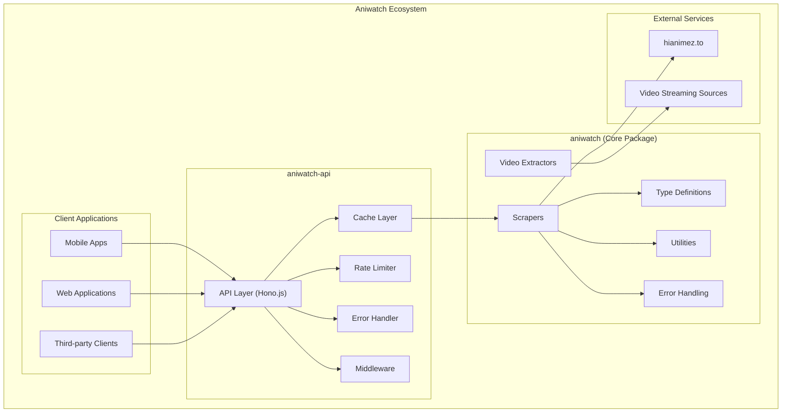
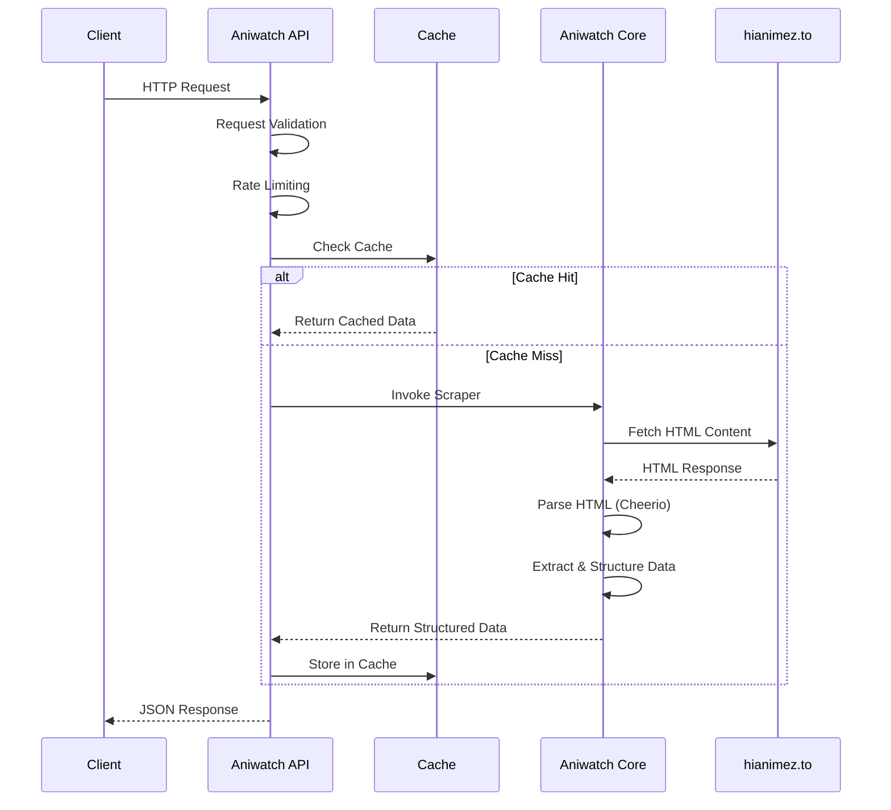
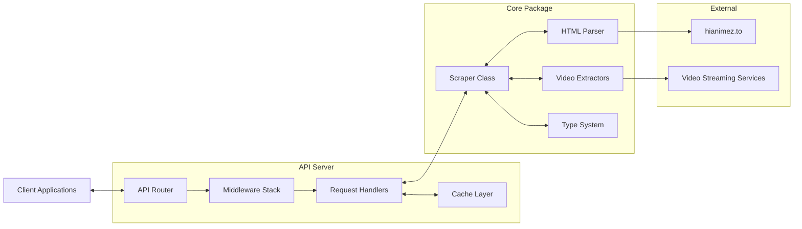
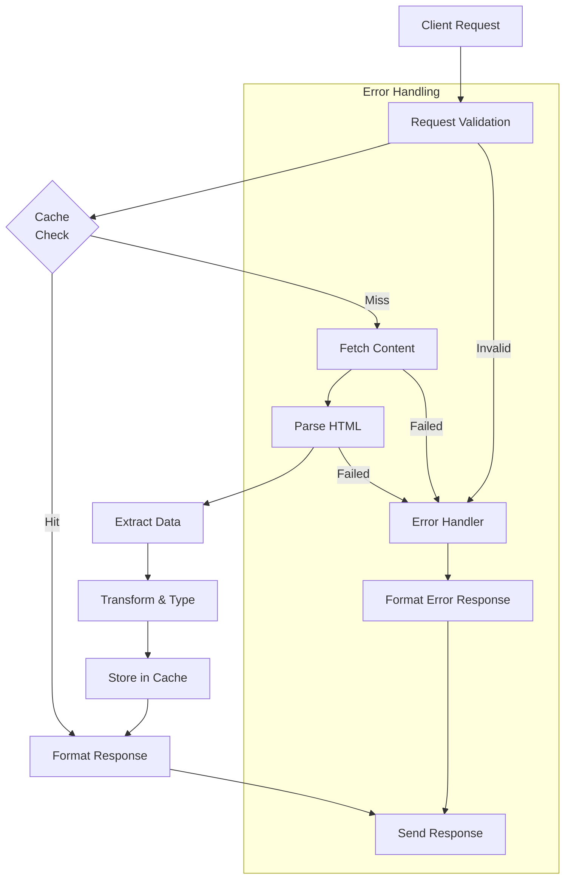
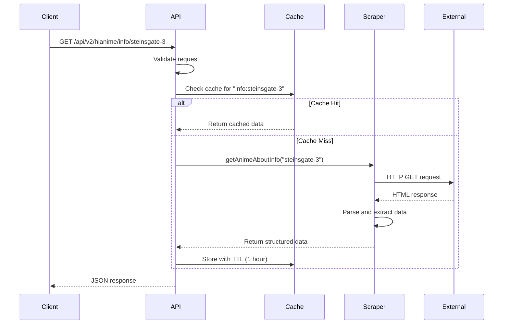
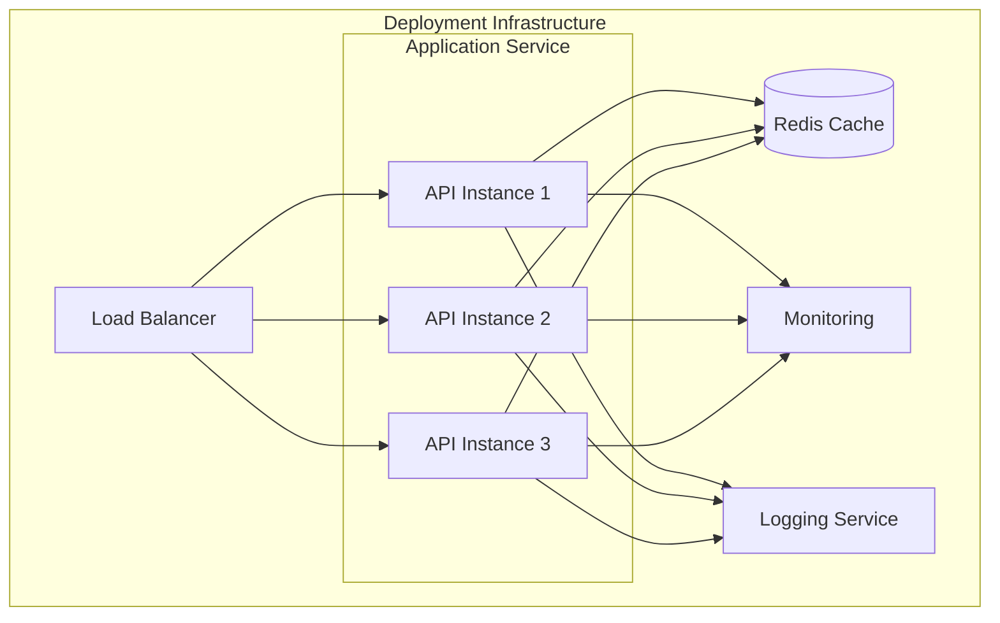

# Aniwatch Technical Architecture & Implementation

## Table of Contents
- [Architecture Overview](#architecture-overview)
- [Technical Implementation](#technical-implementation)
  - [Core Components](#core-components)
  - [Data Flow & Processing](#data-flow--processing)
  - [Error Handling](#error-handling)
  - [Performance Optimization](#performance-optimization)
- [Web Scraping Techniques](#web-scraping-techniques)
- [API Design](#api-design)
- [Security Considerations](#security-considerations)
- [Deployment Architecture](#deployment-architecture)
- [Architecture Diagrams](#architecture-diagrams)

## Architecture Overview

The Aniwatch ecosystem consists of two primary components, architected following a modular design pattern:

1. **aniwatch (Core Package)**: A TypeScript library implementing scraping functionality for hianimez.to
2. **aniwatch-api (API Server)**: A RESTful API server built with Hono.js that exposes the core package functionality through HTTP endpoints



## Technical Implementation

### Core Components

#### 1. Core Package (`aniwatch`)

The core package is built as a TypeScript library with the following key components:

**Scraping Engine:**
- Uses Cheerio for HTML parsing
- Implements request handling with custom client abstraction
- Applies data extraction patterns for different anime content types

**Type System:**
- Comprehensive TypeScript interfaces for all data structures
- Extensive type safety throughout the codebase
- Type guards for runtime validation

**Video Source Extractors:**
- Specialized modules for different streaming platforms
- Decryption utilities for proprietary encoding methods
- Stream URL resolution algorithms

**Directory Structure:**
```
src/
├── index.ts                 # Main export file
├── config/                  # Configuration for clients, errors, logging
│   ├── client.ts            # HTTP client configuration
│   ├── error.ts             # Error type definitions
│   └── logger.ts            # Logging utilities
├── extractors/              # Video source extraction
│   ├── index.ts             # Extractor exports
│   ├── megacloud.ts         # MegaCloud extractor
│   ├── rapidcloud.ts        # RapidCloud extractor
│   ├── streamsb.ts          # StreamSB extractor
│   └── streamtape.ts        # StreamTape extractor
├── hianime/                 # Core scraper logic
│   ├── error.ts             # HiAnime specific errors
│   ├── hianime.ts           # Main Scraper class
│   ├── scrapers/            # Individual scrapers by content type
│   └── types/               # TypeScript type definitions
└── utils/                   # Helper functions
    ├── constants.ts         # Shared constants
    ├── index.ts             # Utility exports
    └── methods.ts           # Common methods
```

#### 2. API Server (`aniwatch-api`)

The API server is built using modern JavaScript/TypeScript technologies:

**Framework:**
- Hono.js - A lightweight web framework designed for edge computing environments

**Key Middleware:**
- CORS handling for cross-origin requests
- Caching layer for performance optimization
- Rate limiting for API protection
- Request logging for monitoring
- Error handling for consistent error responses

**Deployment Support:**
- Docker containerization
- Vercel serverless configuration
- Render deployment support

**Directory Structure:**
```
src/
├── server.ts               # Server initialization
├── utils.ts                # Utility functions
├── globals.ts              # Global type declarations
├── config/                 # Server configuration
│   ├── cache.ts            # Caching mechanism
│   ├── context.ts          # Request context types
│   ├── cors.ts             # CORS configuration
│   ├── env.ts              # Environment variables
│   ├── errorHandler.ts     # Error handling
│   ├── logger.ts           # Logging configuration
│   └── ratelimit.ts        # Rate limiting
├── middleware/             # Request processing
│   ├── cache.ts            # Cache control
│   └── logging.ts          # Request logging
└── routes/                 # API endpoints
    └── hianime.ts          # HiAnime API routes
```

### Data Flow & Processing

The data flow within the system follows a well-structured pipeline:

1. **Client Request:** An HTTP request is received by the API server
2. **API Layer Processing:**
   - Request validation
   - Rate limiting check
   - Cache lookup
3. **Core Package Invocation:**
   - If cache miss, relevant scraper is invoked
   - Request is made to hianimez.to
   - HTML content is parsed with Cheerio
   - Data is extracted and structured according to TypeScript types
4. **Response Processing:**
   - Data is cached for future requests
   - Response is formatted as JSON
   - Appropriate headers are added
5. **Client Delivery:** Response is sent back to the client



### Error Handling

The system implements a comprehensive error handling strategy:

1. **Custom Error Types:**
   - `HiAnimeError`: Specific to anime content issues
   - `AniwatchError`: Generic package errors
   - `ExtractorError`: Problems with video source extraction

2. **HTTP Error Mapping:**
   - 400: Bad Request - Invalid parameters
   - 404: Not Found - Content not available
   - 429: Too Many Requests - Rate limit reached
   - 500: Server Error - Unexpected failures
   - 503: Service Unavailable - External service issues

3. **Error Response Format:**
```json
{
  "status": 404,
  "error": "Not Found",
  "message": "Anime with ID 'invalid-id' not found"
}
```

### Performance Optimization

The system incorporates several performance optimization techniques:

1. **Caching Strategy:**
   - In-memory caching for API responses
   - Configurable TTL (Time-to-Live) based on content type
   - Cache key generation based on request parameters

2. **Request Optimization:**
   - Connection pooling for external requests
   - Timeout handling for unresponsive external services
   - Compression for network transfer

3. **Response Optimization:**
   - Selective field inclusion
   - Pagination for large data sets
   - Response compression

## Web Scraping Techniques

The core of the aniwatch package employs sophisticated web scraping techniques:

1. **HTML Parsing with Cheerio:**
   - DOM traversal for targeted data extraction
   - Selector-based content identification
   - Attribute and text content extraction

2. **Dynamic Content Handling:**
   - Waiting for DOM content to load
   - Extracting data from JavaScript variables in the page
   - Handling lazy-loaded content

3. **Video Source Extraction:**
   - Decrypting obfuscated video source URLs
   - Extracting metadata for different quality options
   - Handling authentication tokens for streaming services

4. **Resilience Mechanisms:**
   - Retry logic for failed requests
   - Fallback strategies for unavailable content
   - Error detection and recovery

## API Design

The API follows RESTful design principles with the following characteristics:

1. **Resource-Oriented Endpoints:**
   - `/api/v2/hianime/home`: Homepage content
   - `/api/v2/hianime/info/{animeId}`: Detailed anime information
   - `/api/v2/hianime/episodes/{animeId}`: Episode listings

2. **Query Parameter Support:**
   - Pagination: `page=1&limit=20`
   - Filtering: `dub=true&season=fall`
   - Sorting: `sort=popularity&order=desc`

3. **Response Format:**
   - Consistent JSON structure
   - Status code in response body and HTTP header
   - Metadata for pagination and query information

4. **Error Handling:**
   - Descriptive error messages
   - Appropriate HTTP status codes
   - Suggestion for error resolution when possible

5. **Performance Considerations:**
   - Cache-Control headers
   - ETag support for conditional requests
   - Compression for response payload

## Security Considerations

The system implements various security measures:

1. **Input Validation:**
   - Parameter sanitization
   - Type checking and validation
   - Protection against injection attacks

2. **Rate Limiting:**
   - Configurable request limits
   - IP-based rate limiting
   - Custom rate limit for specific endpoints

3. **CORS Configuration:**
   - Configurable origin restrictions
   - Preflight request handling
   - Header control for cross-origin requests

4. **HTTP Security Headers:**
   - Content-Security-Policy
   - X-Content-Type-Options
   - X-Frame-Options

## Deployment Architecture

The system supports multiple deployment options:

1. **Docker Deployment:**
   - Multi-stage build for optimization
   - Environment variable configuration
   - Health check endpoint

2. **Serverless Deployment:**
   - Vercel configuration
   - Edge function compatibility
   - Cold start optimization

3. **Traditional Hosting:**
   - Node.js runtime requirements
   - Nginx reverse proxy configuration
   - Process management with PM2

## Architecture Diagrams

### Component Interaction Diagram



### Data Flow Diagram



### API Request Sequence



### Deployment Architecture Diagram



## Key Technical Decisions

### 1. Cheerio Over Puppeteer/Playwright

The project uses Cheerio for HTML parsing rather than headless browsers like Puppeteer or Playwright. This decision was made to:

- Minimize resource usage and improve performance
- Reduce deployment complexity
- Decrease response time for API requests

Cheerio provides sufficient functionality for the static content parsing needs of the project while being significantly lighter than a full headless browser solution.

### 2. TypeScript for Type Safety

TypeScript was chosen as the primary language for both the core package and API server to:

- Ensure type safety across the codebase
- Provide better developer experience through IDE support
- Catch potential errors during development
- Document the API interfaces through type definitions

### 3. Hono.js as Web Framework

The API server uses Hono.js rather than Express or other alternatives because:

- Hono is designed for edge computing environments
- It has excellent TypeScript support
- The framework is lightweight yet feature-rich
- It provides good performance characteristics

### 4. In-Memory Caching Strategy

The system implements an in-memory caching strategy rather than an external cache like Redis because:

- It simplifies deployment requirements
- It's sufficient for the expected load in most deployments
- It reduces external dependencies

For larger deployments, the caching mechanism can be replaced with a distributed solution like Redis with minimal changes to the codebase.

### 5. Serverless-First Approach

The architecture supports serverless deployment as a primary option because:

- It allows for cost-effective scaling
- It simplifies operations and maintenance
- It provides global distribution capabilities
- It reduces infrastructure management overhead

The code is designed to work efficiently within the constraints of serverless environments while still supporting traditional deployment options.
