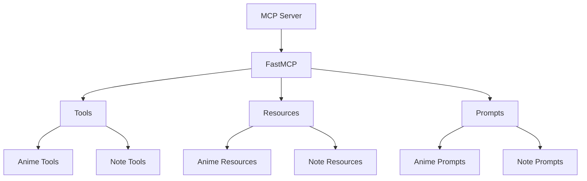

# System Patterns

## Architecture Overview
1. Scraper System
   - Cloudflare bypass using cloudscraper
   - HTML parsing with BeautifulSoup
   - Structured data extraction
   - Error handling and logging
   - Debug file generation

2. Data Flow
   ```
   Request → Cloudflare Bypass → HTML Fetch → Parse → Extract → Structure → Output
   ```

3. Error Handling
   - Exception catching at each level
   - Detailed error logging
   - Debug file generation
   - Graceful failure handling

4. Logging System
   - Debug level logging
   - Request/response logging
   - Error logging
   - Structure analysis logging

## Design Patterns
1. Scraper Pattern
   - Single responsibility for data extraction
   - Modular component design
   - Clear separation of concerns
   - Extensible structure

2. Error Handling Pattern
   - Try-except blocks at each level
   - Detailed error messages
   - Debug information preservation
   - Graceful degradation

3. Logging Pattern
   - Hierarchical logging
   - Contextual information
   - Debug file generation
   - Structure preservation

4. Data Extraction Pattern
   - Structured data model
   - Clear extraction paths
   - Validation points
   - Error recovery

## Component Relationships
1. Main Components
   - Scraper: Handles HTTP requests and Cloudflare bypass
   - Parser: Processes HTML content
   - Extractor: Pulls specific data
   - Logger: Manages debugging information

2. Data Flow
   ```
   Scraper → Parser → Extractor → Data Structure
   ```

3. Error Flow
   ```
   Error → Logger → Debug File → Error Response
   ```

## Technical Decisions
1. Cloudflare Bypass
   - Using cloudscraper
   - Custom headers
   - Browser emulation
   - Session management

2. HTML Parsing
   - BeautifulSoup with lxml
   - CSS selectors
   - Structured extraction
   - Error handling

3. Data Structure
   - JSON format
   - Nested objects
   - Optional fields
   - Type safety

4. Debug System
   - File-based debugging
   - HTML preservation
   - Structure analysis
   - Error tracking

## Implementation Patterns
1. Request Handling
   - Headers management
   - Session handling
   - Error recovery
   - Response validation

2. Data Extraction
   - CSS selector patterns
   - Data validation
   - Error handling
   - Structure preservation

3. Error Management
   - Exception hierarchy
   - Error logging
   - Debug information
   - Recovery strategies

4. Logging Strategy
   - Level-based logging
   - Context preservation
   - File generation
   - Structure analysis

## Future Patterns
1. Rate Limiting
   - Request throttling
   - Queue management
   - Error handling
   - Recovery strategies

2. Caching
   - Response caching
   - Data persistence
   - Cache invalidation
   - Error handling

3. Proxy Support
   - Proxy rotation
   - Error handling
   - Session management
   - Request routing

4. Retry Mechanism
   - Exponential backoff
   - Error recovery
   - Request validation
   - Success verification

## MCP Server Architecture


## MCP Tool Pattern
```python
@mcp.tool()
def tool_name(ctx: Context) -> ReturnType:
    """Tool description"""
    try:
        # Implementation
        return result
    except Exception as e:
        logger.error(f"Error message: {str(e)}")
        raise Exception(f"Error message: {str(e)}")
```

## MCP Resource Pattern
```python
@mcp.resource("resource://{param}")
def resource_name(param: str) -> dict:
    """Resource description"""
    try:
        # Implementation
        return result
    except Exception as e:
        logger.error(f"Error message: {str(e)}")
        raise Exception(f"Error message: {str(e)}")
```

## MCP Prompt Pattern
```python
@mcp.prompt()
def prompt_name() -> str:
    """Prompt description"""
    try:
        # Implementation
        return formatted_result
    except Exception as e:
        logger.error(f"Error message: {str(e)}")
        return error_message
```

## Best Practices

### Code Organization
- Separate concerns into different modules
- Use type hints consistently
- Document all public interfaces
- Handle errors at appropriate levels

### Testing Strategy
- Unit tests for individual components
- Integration tests for MCP functionality
- End-to-end tests with MCP Inspector
- Error case testing

### Logging Strategy
- Use appropriate log levels
- Include context in log messages
- Log to stderr for better debugging
- Handle sensitive data appropriately 